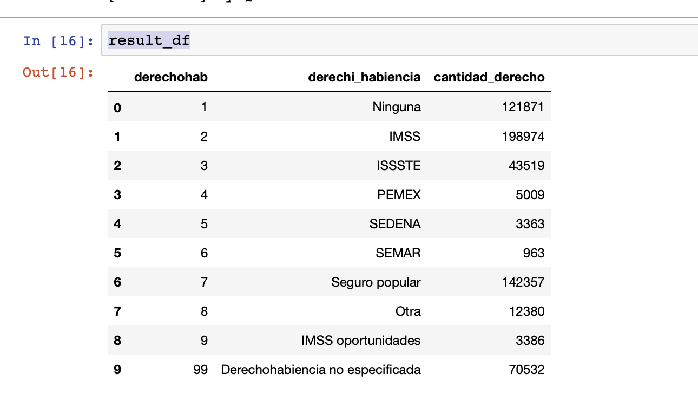

# ETL Project
By Data Panas

## Authors
* Daniel Cespedes - [LinkedIn](https://www.linkedin.com/in/selinzorob/) - [GitHub](https://github.com/danielczz)
* Joel Sotelo - [LinkedIn](https://www.linkedin.com/in/joelsotelods/) - [GitHub](https://github.com/joelsotelods)


## Process

Import dependencies:

```python
%matplotlib notebook
# Dependencies declaration
import matplotlib.pyplot as plt
import numpy as np
import pandas as pd
import sqlalchemy
from sqlalchemy import create_engine
import os

from pandas.io import sql

from pandas import DataFrame


import mysql.connector
from mysql.connector import Error
from mysql.connector import errorcode

from config import database_username
from config import database_password
```

### Import all DB catalogs

Read all the path/names of the catalog files

```python
pwd = os.getcwd()
#print(pwd)
pwd = pwd + '/resources/catalogos'
#print(pwd)


for path, folders, files in os.walk(pwd):
   ## just rename folders inside path 
    if pwd == path:
        #print(path)
        #print(folders)
        print(files)
print(type(files))
print(len(files))
```
Output:
```
['decomplicaemba.csv', 'deurbrur.csv', 'dederech.csv', 'degpolisme.csv', 'decertif.csv', 'decateml.csv', 'delista1.csv', 'deesco.csv', 'decondact.csv', 'deparenagresor.csv', 'desitiolesion.csv', 'decondemba.csv', 'deedadagrup.csv', 'desexo.csv', 'decatcausa.csv', 'deocutrab.csv', 'delistamex.csv', 'demeses.csv', 'dehoradef.csv', 'desitiodefun.csv', 'detamloc.csv', 'deedocony.csv', 'deocupa.csv', 'deedad.csv', 'delengindi.csv', 'depresunto.csv', 'demindef.csv', 'derelemba.csv', 'decapitulo.csv', 'denacion.csv', 'deviofam.csv', 'denecrop.csv', 'deasismed.csv', 'dedias.csv', 'derazonm.csv', 'deyear.csv', 'decapgpo.csv']
<class 'list'>
37
```

### Connect to the database

```python
database_ip       = '127.0.0.1'
database_name     = 'defunciones_inegi_db'

mydb = mysql.connector.connect(
  host=database_ip,
  user=database_username,
  passwd=database_password
)

mycursor = mydb.cursor()
## creates database if it doesnt exist!!!! :P :O we are PROS bro.
mycursor.execute("CREATE DATABASE IF NOT EXISTS defunciones_inegi_db;")

mydb.close()

database_connection = sqlalchemy.create_engine('mysql+mysqlconnector://{0}:{1}@{2}/{3}?charset=latin1'.format(database_username, database_password, database_ip, database_name))
```

### read each CSV and load it to the database as a table:

```python
print(f'###### Creating the tables')
for x in files:
    try:
        
        if x == 'decateml.csv':
            df = pd.read_csv("resources/catalogos/"+ x, encoding ='latin1')
            s = x.split(".csv")
            df = df.rename(columns={'CVE': str(s[0]) + "_id"})
            df = df.rename(columns={'cve_ent': str(s[0]) + "_entidad_id"})
            df = df.rename(columns={'cve_mun': str(s[0]) + "_municipio_id"})
            df = df.rename(columns={'cve_loc': str(s[0]) + "_locacion_id"})
            df.to_sql("c_"+str(s[0]), con=database_connection, if_exists='replace', index=False) 
        else:
            df = pd.read_csv("resources/catalogos/"+ x, encoding='latin1')
            s = x.split(".csv")
            df = df.rename(columns={'CVE': str(s[0]) + "_id"})
            df.to_sql("c_"+str(s[0]), con=database_connection, if_exists='replace', index=False) 
        

            
    
    except Exception as e:
      print(f'Error detected in file', str(e))
print(f'###### Tables created')

```

### Here the script runs a sql script <create_db_schema.sql> that we created to create the transactional table and a view to join two tables.
```python
# Open and read the file as a single buffer
fd = open('create_db_schema.sql', 'r')
sqlFile = fd.read()
fd.close()

# all SQL commands (split on ';')
sqlCommands = sqlFile.split(';')


try:
    print('[#########] Running the create_db_schema.sql script')
    
    conn = mysql.connector.connect(host=database_ip,
                             database=database_name,
                             user=database_username,
                             password=database_password)
    cursor = conn.cursor()
    
    for command in sqlCommands:
        try:
            cursor.execute(command)
            #print(command)
        except Exception as e:
            print(f'Error detected: ', str(e))
            
    print('[#########] create_db_schema.sql script ran succesfuly')
    
except Exception as e:
        print(f'Error detected: ', str(e))
finally:
    #closing database connection.
    if(conn.is_connected()):
        conn.close()
        print('[#########] MySQL connection is closed')
```

### Read the transactional data csv

```python
d_defunciones_generales = 'defunciones_generales_2012.csv'

df = pd.read_csv("resources/conjunto_de_datos/"+ d_defunciones_generales, encoding ='latin1')
```


```python
### Se guardan los datos de 10K en 10K en la base de datos
### porque por alguna razon si se meten mas datos el programa crashea

cargar_de = 10000 

indexx = 0
limit = len(df)

while (indexx<=limit):
    
    final =  indexx + cargar_de
    
    try:
        print(f'[#########] Saving from index {indexx} to {final}.')
        df.iloc[indexx:final].to_sql(name='d_defunciones_generales', con=database_connection, if_exists='append', index=False) 

    except Exception as e:
        print(f'Error detected in file', str(e))
        
    indexx = indexx + cargar_de

print(f'[#########]  Data saved.')
```


## Validate the data

Now we proceed to read from our database with a simple query joinig our transactional table with a catalog:

```python

try:
    print("[#########] Reading table")
    
    conn = mysql.connector.connect(host=database_ip,
                             database=database_name,
                             user=database_username,
                             password=database_password)
    cursor = conn.cursor()
    
    sql_select_Query = "select * from vw_derecho_habiencia;"

    cursor.execute(sql_select_Query)

    result_df = DataFrame(cursor.fetchall())
    table_desc = cursor.description
 
    headers = []
    for header in table_desc:
        headers.append(header[0])
    
    result_df.columns = headers
    
    #for row in records:
    #    print(row)

    cursor.close()
    
    print("[#########] Table saved to dataframe")

except Exception as e:
    print(f'Error detected in file', str(e))
finally:
    #closing database connection.
    if(conn.is_connected()):
        conn.close()
        print("[#########] MySQL connection is closed")
```


```python
result_df

```

